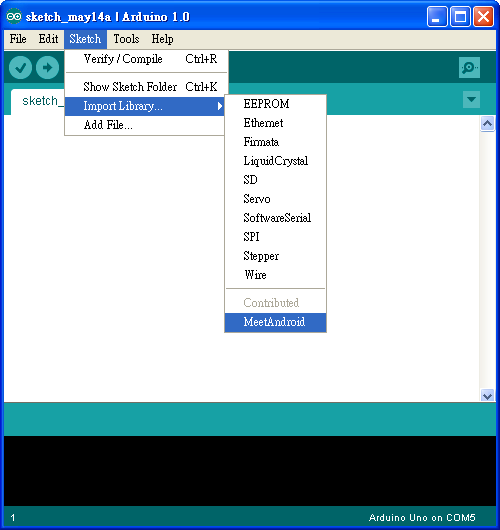
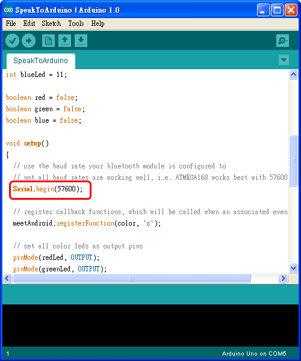
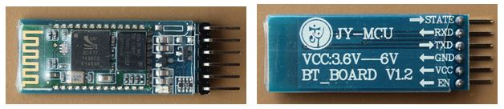
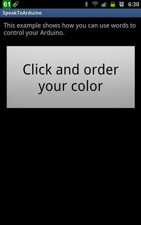
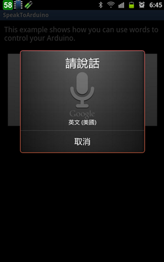

## Arduino入門教學(16) – Amarino 的 SpeakToArduino 範例程式 (作者：Cooper Maa)

這篇是寫給 amarino 初學者看的，目的是教導你如何執行 Amarino 的 SpeakToArduino 範例程式。SpeakToArduino 這個範例示範如何用 Android 手機聲控 Arduino。

### 所需材料

* Android 手機一支
* Arduino x1
* bluetooth module x 1
* 紅色 LED, 綠色 LED 及藍色 LED 各一顆（若無特定顏色 LED，可用其它顏色的 LED 取代），或一顆 RGB Led
* 220 歐姆電阻 x 3

### Step 1：安裝 Amarino

到 <http://www.amarino-toolkit.net/> 下載下列 App 並安裝到 Android 手機上：

1) [Amarino](http://code.google.com/p/amarino/downloads/detail?name=Amarino_2_v0_55.apk&can=2&q=)

2) [Amarino Plug-in Bundle](http://code.google.com/p/amarino/downloads/detail?name=AmarinoPluginBundle.apk&can=2&q=)

3) [SpeakToArduino](http://code.google.com/p/amarino-examples/downloads/detail?name=SpeakToArduino.apk&can=2&q=#makechanges)

### Step 2: 安裝 Arduino IDE 與 MeetAndroid Library

如果你電腦上還沒有 Arduino IDE，請先到 <http://arduino.cc/en/Main/Software> 下載軟體，下載後解壓縮即可。

接著下載 [MeetAndroid Library](http://code.google.com/p/amarino/downloads/detail?name=MeetAndroid_4.zip&can=2&q=)，把 MeetAndroid 解到 Arduino IDE 安裝目錄下的 libraries 資料夾。

重新啟動 Arduino IDE，在 Sketch > Import Library 底下應該會看到 MeetAndroid，如下圖：

### Step 3：連接 LED

參考下圖，把紅、綠、藍三顆 LED 分別接到 pin 9, 10, 11，LED 的接法為: 長腳（陽極）接到 pin 腳，而短腳（陰極）串接一顆 220 ohm 電阻接到 GND：

### Step 4： 上傳 SpeakToArduino 程式

到這裏下載，並使用 Arduino IDE 打開 SpeakToArduino 程式。

程式所用的 baud rate 預設是 57600 bps，如果你的藍芽模組不是 57600 bps，請做適當的調整：

然後把程式上傳到 Arduino 板子上。

### Step 5：連接藍芽模組

我用的是 [廣州匯承信息科技](http://www.wavesen.com/) 的 HC-0x 系列藍芽模組，下圖是 HC-0x 藍芽模組的外觀：

連接方法很簡單，照下表把 Arduino 和藍芽模組連接起來就好：

Arduino   藍芽模組        備註
--------  -------------   ---------------------
5V        VCC             注意電源不可接錯
GND       GND             注意電源不可接錯
RXD       TXD         
TXD       RXD         

有兩點要注意：第一是電源千萬不可接錯，不然可能會燒壞藍芽模組，第二是 Arduino 的 RXD 要接藍芽模組的 TXD，而 Arduino 的 TXD 要接藍芽模組的 RXD。

通電之後，藍芽模組上的 LED 會一直閃爍：

### Step 6：執行 SpeakToArduino App

首先，先利用 Amarino 搜尋藍芽設備，找到設備後，將藍芽設備的 MAC Address 抄起來（記得不要在 Amarino 設定任何 Event！）：

打開 Android 手機上的 SpeakToArduino App，你會看到這樣的畫面:

選手機 Menu 鍵 Set BT Device Address，手機會跳出這個畫面，此時請輸入剛剛抄下來的 MAC Address，然後按下【Save】鈕:

按一下手機 Back 鍵退出 SpeakToArduino App，然後重新啟動 SpeakToArduino，這樣 App 才會用新的 Mac Adress 跟藍芽模組連線。

如果一切順利，Android 手機就會跟 Arduino 建立連線，並且呈現如下圖的畫面（注意手機上方的 Status bar，若有成功與 Arduino 連線，status bar 上會顯示 Active connection: … 的訊息）：

按下【Click and order your color】鈕，手機會跳出語音辨識的畫面：

這時便可以說出想要的顏色，例如 red, green, blue, white, pink, orange, yellow, dark 或 off，這時候 Arduino 上三顆 LED 便會同步改變亮度。比如當我說 red，這時 Android 手機就會叫 Arduino 把紅色 LED 打開：

如果你有 RGB Led，可以用一顆 RGB Led 取代三顆 Led，這樣更可以呈現 LED 顏色變化的效果。

### 參考資料
* [Getting Started with Amarino 簡報](http://coopermaa2nd.blogspot.tw/2012/07/getting-started-with-amarino.html)
* [以 Amarino 連接 Android 與 Arduino](http://coopermaa2nd.blogspot.tw/2012/06/amarino-android-arduino.html)
* [MultiColorLamp](http://coopermaa2nd.blogspot.tw/2012/06/multicolorlamp.html)
* [SensorGraph](http://coopermaa2nd.blogspot.tw/2012/06/sensorgraph.html)

【本文作者為馬萬圳，原文網址為： <http://coopermaa2nd.blogspot.tw/2012/07/speaktoarduino.html> ，由陳鍾誠編輯後納入本雜誌】

