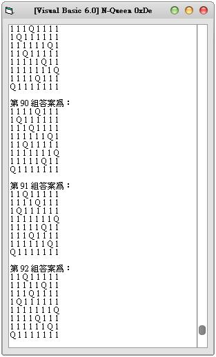

## Visual Basic 6.0:利用遞迴與程序導向解 N Queens Puzzle 皇后問題 (作者：廖憲得 0xde)

什麼是 N Queens Puzzle 皇后問題問題？　
通常我們都會用 8 皇后來稱呼它，但將 8 改成動態數字 n，則稱為 n 皇后
 
什麼是 8 Queens Puzzle 皇后問題問題？　

那麼 8 皇后問題又是什麼呢？

>  八皇后問題是一個以西洋棋為背景的問題：如何能夠在8×8的西洋棋棋盤上放置八個皇后，使得任何一個皇后都無法直接吃掉其他的皇后？ 
> 為了達到此目的，任兩個皇后都不能處於同一條橫行、縱行或斜線上。
> 八皇后問題可以推廣為更一般的n皇后擺放問題 ：這時棋盤的大小變為n × n ，而皇后個數也變成n 。 若且唯若 n = 1或n ≥ 4時問題有解[1] 。
 
* 維基百科：<http://en.wikipedia.org/wiki/Eight_queens>
 

 


```
【1皇后】共1組解  
【2皇后】共0組解  
【3皇后】共0組解  
【4皇后】共2組解  
【5皇后】共10組解  
【6皇后】共4組解  
【7皇后】共40組解  
【8皇后】共92組解  
【9皇后】共352組解  
【10皇后】共724組解  
【11皇后】共2680組解  
【12皇后】共14200組解  
【13皇后】共73712組解  
【14皇后】共365596組解  
【15皇后】共2279184組解  
【16皇后】共14772512組解  
```

通常跑超過 10 皇后就需要等待不少時間了！
 
如何使用遞迴與程序導向去實作呢？

```monobasic
Dim QueenXY() ' 棋盤
Dim TempQueenXY(9999) ' 暫存的棋盤
Dim TempNumber ' 數量
Dim QueenNumber ' 正解總數
Private Sub Form_Activate()
Queen = 9 ' 皇后數

ReDim QueenXY(Queen - 1, Queen - 1) ' 配置棋盤

For I = 0 To Queen - 1
    For J = 0 To Queen - 1
        QueenXY(I, J) = 0
    Next J
Next I
    
    QueenNumber = 0
    List1.Clear
    
For I = 0 To UBound(QueenXY)
    Call InputQueen(I, 0)
Next I

    MsgBox "總解有 => " & QueenNumber & " 組"
End Sub


Function InputQueen(X, Y) ' 放置皇后
    If X >= 0 And X <= UBound(QueenXY) And Y >= 0 And Y <= UBound(QueenXY) Then ' 判斷棋盤是否超過
        
        If QueenXY(X, Y) = 0 Then ' 判斷是否為可放 (是否被殺)
            

            
            BackupTemp ' Step 備份目前棋盤狀
            Call KillQueen(X, Y) ' 建立被殺
            For I = 0 To UBound(QueenXY) ' 放下一個
                Call InputQueen(I, Y + 1)
            Next I
            If Y = UBound(QueenXY) Then
                QueenNumber = QueenNumber + 1
                
                
                Temp = ""
                        List1.AddItem "第 " & QueenNumber & " 組答案為："
                For I = 0 To UBound(QueenXY)
                    For J = 0 To UBound(QueenXY)
                        Temp = Temp & QueenXY(I, J) & " "
                    Next J
                        List1.AddItem Temp
                        Temp = ""
                Next I
                        List1.AddItem ""
                
            End If
                
                Reductive ' 還原
        End If
    End If
End Function

Function KillQueen(KX, KY) ' 跟自己八方被殺

QueenXY(KX, KY) = "Q"

For I = 0 To UBound(QueenXY)
    For J = 0 To UBound(QueenXY)
        If I = KX And J = KY Then
        Else
            If I = KX Or J = KY Then QueenXY(I, J) = 1 ' 四面
            
            If (J - KY) <> 0 And (I - KX) <> 0 Then ' 不為 0 (自己)
                If Abs((J - KY) / (I - KX)) = 1 Then QueenXY(I, J) = 1 ' 八方 (斜率絕對值 = 1)
            End If
        End If
    Next J
Next I

End Function

Function BackupTemp() ' 備份
    Temp = ""
    For I = 0 To UBound(QueenXY)
        For J = 0 To UBound(QueenXY)
             Temp = Temp & QueenXY(I, J) & ","
        Next J
    Next I
    
    TempQueenXY(TempNumber) = Temp
    TempNumber = TempNumber + 1
End Function

Function Reductive() ' 還原
    Temp = Split(TempQueenXY(TempNumber - 1), ",")
    TempI = 0
    For I = 0 To UBound(QueenXY)
        For J = 0 To UBound(QueenXY)
            QueenXY(I, J) = Temp(TempI)
            TempI = TempI + 1
        Next J
    Next I
    
    TempNumber = TempNumber - 1
End Function

```

* 原始碼下載： [N皇后(N Queen).rar](http://files.dotblogs.com.tw/0xde/1311/2013111193556893.rar)

【本文作者為「廖憲得」，原文網址為： <http://www.dotblogs.com.tw/0xde/archive/2013/11/11/127531.aspx> ，由陳鍾誠編輯後納入本雜誌】
